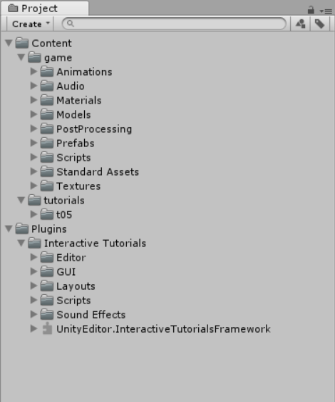
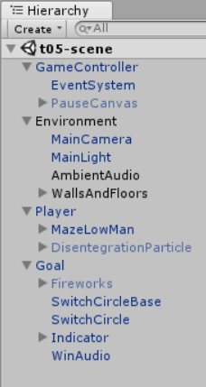

##### 1.解释 游戏对象（GameObjects） 和 资源（Assets）的区别与联系。

- Gameobject是游戏中的基本组件，是游戏过程中的基本单位。它具有一系列，可扩展的component，并为他们提供封装。

- Assets是游戏中各种可能用到的资源，material，sounds，pictures等等，（不知道预制算不算assets，我记得在做table预制时是保存在assets里的）
- Assets可以作为部件，组成在Gameobject中，若预制算Assets，那么Gameobject也可以组成为预制作为Assets的一部分。

##### 2.下载几个游戏案例，分别总结资源、对象组织的结构（指资源的目录组织结构与游戏对象树的层次结构）



- 上面的样例可见，该游戏资源的内容分为预制、脚本等等，按照文件的类型的不同，添加到不同的文件夹当中，便于后面的资源整理和利用



- 游戏对象分为了，game control, environment, players and game goals.可以看出主要从游戏机制，环境，角色，游戏目标来对整个游戏进行分类。

- 对象结构与资源结构，基本符合游戏引擎架构图中的designer部分。

##### 3.编写一个代码，使用 debug 语句来验证MonoBehaviour基本行为或事件触发的条件

- 基本行为包括 Awake() Start() Update() FixedUpdate() LateUpdate()
- 常用事件包括 OnGUI() OnDisable() OnEnable()

```
using System.Collections;
using System.Collections.Generic;
using UnityEngine;

// 编写一个代码，使用 debug 语句来验证 MonoBehaviour 基本行为或事件触发的条件
// 基本行为包括 Awake() Start() Update() FixedUpdate() LateUpdate()
// 常用事件包括 OnGUI() OnDisable() OnEnable()

public class test : MonoBehaviour
{
    // Awake is called before any Start function
    void Awake()
    {
        Debug.Log("awake");
    }

    // Start is called before the first frame update
    void Start()
    {
        Debug.Log("start");
    }

    // Update is called once per frame
    void Update()
    {
        Debug.Log("update");
    }

    void FixedUpdate()
    {
        Debug.Log("FixedUpdate");
    }

    void LateUpdate()
    {
        Debug.Log("LateUpdate");
    }

    void OnGUI()
    {
        Debug.Log("OnGUI");
    }
    
    void OnDisable()
    {
        Debug.Log("OnDisable");
    }

    void OnEnable()
    {
        Debug.Log("OnEnable");
    }
}
```


| 事件名称   | 执行条件或时机                                               |
| :--------- | :----------------------------------------------------------- |
| Awake      | This function is always called before any Start functions and also just after a prefab is instantiated. (If a GameObject is inactive during start up Awake is not called until it is made active.) |
| Start      | Start is called before the first frame update only if the script instance is enabled. |
| FixUpdate  | **FixedUpdate** is often called more frequently than **Update**. It can be called multiple times per frame. |
| Update     | **Update** is called once per frame. It is the main workhorse function for frame updates. |
| LateUpdate | **LateUpdate** is called once per frame, after **Update** has finished. |
| OnGUI      | Called multiple times per frame in response to GUI events. The Layout and Repaint events are processed first, followed by a Layout and keyboard/mouse event for each input event. |
| OnEnable   | Only called if object is active!                             |
| OnDisable  | This function is called when the behaviour becomes disabled or inactive. |

Form is not right, OnEnalbe should be in front of Start.

##### 4.查找脚本手册，了解GameObject，Transform，Component 对象

- 分别翻译官方对三个对象的描述（Description）

游戏对象是统一体中代表人物、道具和场景的基本对象。它们本身并没有完成多少工作，但是它们充当组件的容器，组件实现真正的功能。

Transform组件决定场景中每个对象的位置、旋转和比例。每个gameobject都有一个transform。

Component是一切附加在游戏物体的基类。

##### 5.描述下图中 table 对象（实体）的属性、table 的 Transform 的属性、 table 的部件

- 本题目要求是把可视化图形编程界面与 Unity API 对应起来，当你在 Inspector 面板上阅读每一个内容，应该知道对应 API。

  

> 第一个选择框是activeSelf：可以定义对象的名称，动静态等属性，比如上图，对象名称是table
> 第二个选择框是Transform：可以定义对象的位置、面向方向、大小
> 第四个选择框是Box Collider：可以调整坐标系的位置、大小
> 第五个选择框是Add Component：可以给对象增加行为,比如给对象增加C#script
> 原文链接：https://blog.csdn.net/gzx1002/article/details/100623692

- 用 UML 图描述 三者的关系（请使用 UMLet 14.1.1 stand-alone版本出图）


- 资源预设（Prefabs）与 对象克隆 (clone)

  - 预设（Prefabs）有什么好处？

  预设可以提前将设计游戏中所需要的游戏对象进行设计打包，成为一个模板。在设计的过程中，随时可以直接从资源当中加载，成为一个游戏对象。预设的存在，方便了面向对象思想的应用，方便我们在设计游戏中更加便捷。

  - 预设与对象克隆 (clone or copy or Instantiate of Unity Object) 关系？

  克隆是将已经存在的游戏对象，或者是资源当中的预设进行复制。克隆可以是对已经添加在视图当中的游戏对象进行复制，也可以是对资源当中，我们提前预设好的模板进行克隆。克隆的进行往往伴随着预设。

  - 制作 table 预制，写一段代码将 table 预制资源实例化成游戏对象

    ```
    using System.Collections;
    using System.Collections.Generic;
    using UnityEngine;
    
    public class LoadBeh : MonoBehaviour {
    
    	public Transform res;
    
    	// Use this for initialization
    	void Start () {
    		// Load Resources
    		GameObject newobj = Instantiate<Transform> (res, this.transform).gameObject;
    		newobj.transform.position = new Vector3 (0, Random.Range (-5, 5), 0);
    	}
    }
    ```


