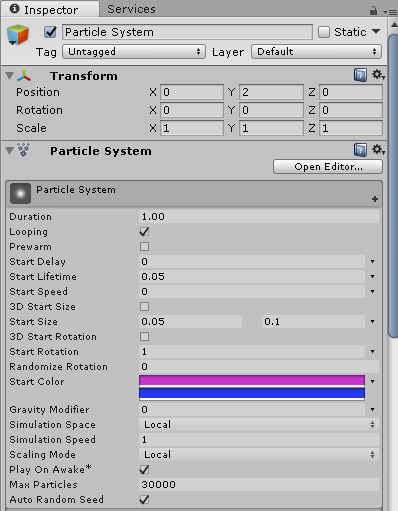
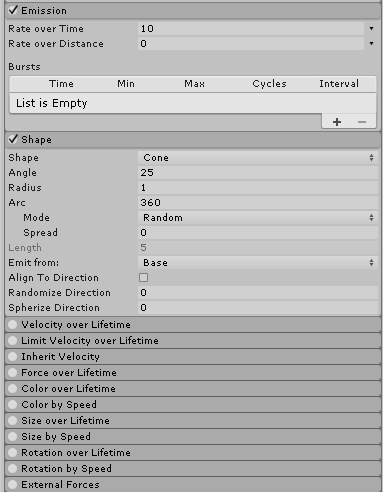
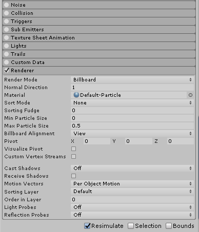
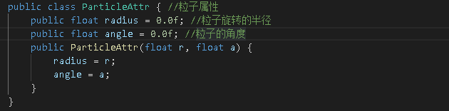
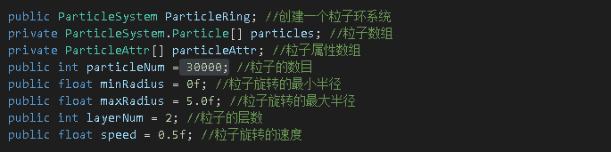
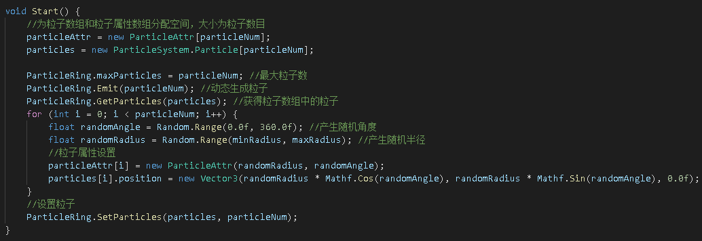
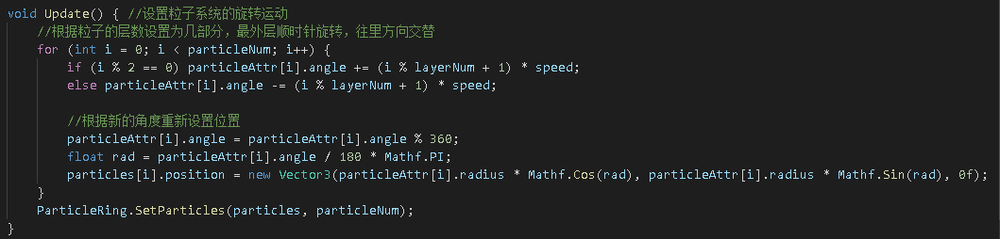
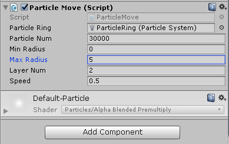

# 作业八：粒子系统  
## 简单粒子制作  
### 演示视频链接：https://www.bilibili.com/video/BV1qA411x7fn/
### 粒子环制作  

- 在Hierarchy界面创建一个Particle System，对其Inspector做以下设置：  
  
  
  
  
- 然后通过"ParticleMove"脚本来设置粒子的属性和运动情况  
   - 先用一个类ParticleAttr定义粒子的两个属性：旋转的半径和角度  
     
   - 然后创建一个粒子系统ParticleRing，同时定义该粒子系统的组成：粒子数组、粒子属性数组、粒子数、粒子的旋转最大、最小半径、粒子的层数和粒子旋转的速度  
     
   - 接着通过Emit函数动态随机产生粒子，并通过GetParticles函数获得产生的粒子，为其设置相应的属性。其中粒子的旋转半径为最大最小半径之间的随机数，角度为0-360°间的随机数  
     
   - 最后将粒子分层，每一层按不同的方向旋转，最外层为顺时针，往里交替  
     

- 将"ParticleMove"脚本添加到ParticleSystem的组件中  
    
  